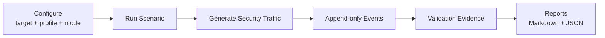

<h1 align="center">Detection Scenario Platform (DSP)</h1>

<p align="center">
  <strong>XDR/NDR과 보안 Lab 검증을 위한 반복 가능한 Security Traffic Generation.</strong>
</p>

<p align="center">
  통제된 Detection Scenario를 실행하고 구조화된 evidence와 validation report를 한 번의 CLI/TUI workflow로 남깁니다.
</p>

<p align="center">
  <a href="README.md">English</a> · <strong>한국어</strong> · <a href="https://dsp.xdr.ooo/">제품 웹사이트</a>
</p>

<p align="center">
  
  
  
  
</p>

<p align="center">
  <strong>제품 웹사이트:</strong> <a href="https://dsp.xdr.ooo/">dsp.xdr.ooo</a>
</p>

---

## 트래픽을 만들고, 증거를 남기고, 같은 테스트를 반복합니다

DSP는 사용자가 지정한 target network에 통제된 보안 scenario traffic을 생성하고 실행 결과를 구조화된 evidence로 저장합니다.

**승인된 Lab, POC, Detection Engineering, XDR/NDR 검증**을 위한 도구입니다. DSP가 검증하는 것은 traffic/event generation과 실행 evidence이며 특정 보안 제품이 반드시 특정 alert를 발생시킨다는 것을 보장하지 않습니다.

## 주요 기능

| 기능 | 설명 |
|---|---|
| **Scenario Execution** | Port sweep, DNS tunnel, HTTP follow-up, SQL injection, SSH failure 등 |
| **Execution Mode** | Local 또는 승인된 Lab의 configured webshell |
| **Event Evidence** | Append-only `events.db` / `events.jsonl` |
| **Validation Report** | Run마다 `report.md`, `validation.json`, `traffic_summary.json` 생성 |
| **Traffic Profile** | low / normal / high profile |
| **Repeatability** | Saved config와 `~/.dsp/runs/`의 run별 결과 |
| **Operator UX** | 일상 사용은 menu, 자동화는 CLI 사용 가능 |

## Workflow



## 빠른 시작

한 번 설치:

```bash
curl -fsSL https://raw.githubusercontent.com/xdr-labs/xdr-poc-script/release/v1.4.0-rc/install-dsp.sh | bash
```

일상 사용:

```bash
cd /path/to/xdr-poc-script
./dsp-menu.sh
```

일반적인 순서:

```text
Configure environment
      ↓
Run scenario
      ↓
Show latest report
      ↓
events / validation / traffic summary 검토
```

## 출력

기본 run output:

```text
~/.dsp/runs/<run_id>/
├── events.db
├── events.jsonl
├── report.md
├── validation.json
└── traffic_summary.json
```

## Execution Mode

- **local** — DSP host에서 target network로 scenario 실행
- **webshell** — 승인된 원격 Lab host의 JSP/PHP/ASPX endpoint를 통해 실행

Webshell mode는 실제 원격 명령 실행을 포함할 수 있으므로 **격리된 승인 환경에서만 사용**합니다. Public Internet에 테스트 webshell을 노출하지 않습니다.

## 요구사항

- Python 3.11+
- git
- python3-venv
- pip
- Debian/Ubuntu TUI 환경에서는 `whiptail` 권장

## 문서

- **제품 웹사이트:** https://dsp.xdr.ooo/
- [Operator Menu](./docs/DSP_MENU.md)
- [Bootstrap Install](./docs/DSP_BOOTSTRAP_INSTALL.md)
- [Lab Guide](./RELEASE_1_0_LAB_GUIDE.md)
- 전체 상세 reference: [README.md](README.md)

---

<p align="center">
  <strong>Controlled scenarios. Repeatable evidence. Safer validation.</strong>
</p>
