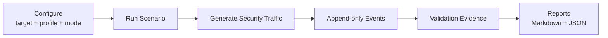

<h1 align="center">Detection Scenario Platform (DSP)</h1>

<p align="center">
  <strong>Repeatable security traffic generation for XDR, NDR, and lab validation.</strong>
</p>

<p align="center">
  Run controlled detection scenarios, capture structured evidence, and produce repeatable validation reports from one CLI/TUI workflow.
</p>

<p align="center">
  <strong>English</strong> · <a href="README.ko.md">한국어</a> · <a href="https://dsp.xdr.ooo/">Product Website</a>
</p>

<p align="center">
  
  
  
  
</p>

<p align="center">
  <strong>Product website:</strong> <a href="https://dsp.xdr.ooo/">dsp.xdr.ooo</a>
</p>

---

## Generate traffic. Keep evidence. Repeat the test.

DSP runs controlled security scenarios against a target network you define and records the run as structured evidence.

It is intended for **authorized labs, POCs, detection engineering, and XDR/NDR validation**. DSP validates traffic/event generation and test evidence; it does not claim that a vendor product must generate a specific alert.

## What it does

| Capability | What DSP provides |
|---|---|
| **Scenario execution** | Port sweep, DNS tunnel, HTTP follow-up, SQL injection, SSH failure, and additional scenarios |
| **Execution modes** | Run locally or through a configured remote webshell in an authorized lab |
| **Event evidence** | Append-only `events.db` / `events.jsonl` run evidence |
| **Validation reports** | `report.md`, `validation.json`, and `traffic_summary.json` per run |
| **Traffic profiles** | Low, normal, and high profiles without memorizing long CLI options |
| **Repeatability** | Saved configuration plus per-run output under `~/.dsp/runs/` |
| **Operator UX** | Menu-first workflow with CLI available for automation |

## Workflow



## Everyday workflow

```bash
cd /path/to/xdr-poc-script
./dsp-menu.sh
```

The normal menu flow is:

```text
Configure environment
      ↓
Run scenario
      ↓
Show latest report
      ↓
Review events / validation / traffic summary
```

For the product guide and current operator documentation, start at **https://dsp.xdr.ooo/**.

> Use DSP only on systems and networks you own or are explicitly authorized to test.

---

## Quick Start

### Step 1 — Install once

Run this **once** on a new machine. It clones or updates the repo, creates `.venv`, installs DSP, and opens the menu.

```bash
curl -fsSL https://raw.githubusercontent.com/xdr-labs/xdr-poc-script/release/v1.4.0-rc/install-dsp.sh | bash
```

Install only (no menu): `DSP_NO_LAUNCH=1 bash install-dsp.sh`

### Step 2 — Use the menu every day

From the repository root:

```bash
cd /path/to/xdr-poc-script
./dsp-menu.sh
```

| Menu item | What it does |
|-----------|----------------|
| **Configure environment** | Target network (CIDR), profile, local vs webshell, webshell URL |
| **Run scenario** | Execute using saved settings |
| **Show latest report** | Open the most recent run under `~/.dsp/runs/` |
| **Update latest patch** | Pull `release/v1.4.0-rc` |
| **Show version/status** | Git state, `dsp --version`, current config |

**Config file:** `~/.dsp/config.env`  
**Run output:** `~/.dsp/runs/<run_id>/` (`report.md`, `events.db`, `validation.json`, …)

---

## Fake JSP webshell lab (quick test)

Use this when you want to try **DSP webshell mode** without installing Tomcat. The script starts a small Flask app that mimics a JSP webshell at `/shell.jsp?cmd=...` — enough for connectivity checks and basic scenario runs in a **lab only**.

> **Warning:** This endpoint runs arbitrary shell commands. Use only on an isolated test machine. Never expose it to the public internet.

### What you need

| Item | Details |
|------|---------|
| OS | Debian/Ubuntu Linux (uses `apt`) |
| Network | Port **8080** free on the webshell host |
| DSP | Installed on the same machine **or** another host that can reach port 8080 |

### Step 1 — Run the setup script

From the repository root (or download the script from GitHub):

```bash
cd /path/to/xdr-poc-script
chmod +x scripts/setup_fake_shelljsp_lab.sh
./scripts/setup_fake_shelljsp_lab.sh
```

The script will:

1. Install `python3`, `python3-venv`, and `curl` (may ask for `sudo`)
2. Create `~/fake_shelljsp_lab/` with a Python virtual environment and Flask server
3. Start the fake webshell on **http://0.0.0.0:8080/shell.jsp**

Leave this terminal open while testing. Press **Ctrl+C** to stop the server.

**Start again later** (after setup):

```bash
cd ~/fake_shelljsp_lab && ./start.sh
```

### Step 2 — Verify the webshell works

Open a **second terminal** on the same machine:

```bash
cd ~/fake_shelljsp_lab
./test_local.sh
```

You should see output from `whoami`, `id`, and `hostname`. Manual check:

```bash
curl --get --data-urlencode "cmd=whoami" http://127.0.0.1:8080/shell.jsp
```

If another machine runs DSP, replace `127.0.0.1` with the webshell host IP (shown when setup finishes). If a firewall blocks access:

```bash
sudo ufw allow 8080/tcp
```

### Step 3 — Point DSP at the fake webshell

**Option A — Menu**

```bash
cd /path/to/xdr-poc-script
./dsp-menu.sh
```

1. **Configure environment**
2. Execution mode: **webshell**
3. Family: **jsp**
4. URL: `http://127.0.0.1:8080/shell.jsp` (same host) or `http://WEBSHELL_HOST_IP:8080/shell.jsp` (remote)
5. Remote work dir: `/tmp/dsp`
6. **Run scenario**

**Option B — CLI**

Same machine as the fake webshell:

```bash
source .venv/bin/activate
dsp run --profile low --target-net 10.10.10.0/24 \
  --execution-provider webshell \
  --webshell-family jsp \
  --webshell-url http://127.0.0.1:8080/shell.jsp \
  --remote-work-dir /tmp/dsp
```

DSP on a different machine (use the webshell host’s IP):

```bash
dsp run --profile low --target-net 10.10.10.0/24 \
  --execution-provider webshell \
  --webshell-family jsp \
  --webshell-url http://10.10.10.50:8080/shell.jsp \
  --remote-work-dir /tmp/dsp
```

### Lab files (after setup)

| Path | Purpose |
|------|---------|
| `~/fake_shelljsp_lab/shell_server.py` | Flask webshell server |
| `~/fake_shelljsp_lab/start.sh` | Start the server |
| `~/fake_shelljsp_lab/test_local.sh` | Quick curl smoke test |
| `scripts/setup_fake_shelljsp_lab.sh` | One-time setup (in this repo) |

### Fake vs real Tomcat

| | Fake lab (this script) | Real Tomcat (`shell.jsp`) |
|--|------------------------|---------------------------|
| Setup time | ~1 minute | Longer (Java/Tomcat install) |
| Best for | Quick DSP webshell smoke tests | Full Release 1.0 validation |
| Validated scenarios | Basic connectivity; not all bundle features | 10/10 scenarios validated |

For production-like validation, use a real Tomcat deployment — see [Lab guide](./RELEASE_1_0_LAB_GUIDE.md) and [JSP validation report](./docs/validation/JSP_REAL_WEBSHELL_VALIDATION_REPORT.md).

---

## Execution modes

| Mode | When to use |
|------|-------------|
| **local** | DSP runs scenarios from this machine into `--target-net` |
| **webshell** | Scenarios run on a remote host through a JSP / PHP / ASPX webshell endpoint |

Webshell configure hints (in the menu):

- **Family:** `jsp`, `php`, or `aspx` — must match the shell file type  
- **URL:** full HTTP(S) path, e.g. `http://10.10.10.50:8080/shell.jsp`  
- **Remote work dir:** writable path on the target, e.g. `/tmp/dsp`

---

## CLI (optional)

If you prefer the command line after `source .venv/bin/activate`:

```bash
# Local run
dsp run --profile normal --target-net 10.10.10.0/24

# Webshell run
dsp run --profile normal --target-net 10.10.10.0/24 \
  --execution-provider webshell \
  --webshell-family jsp \
  --webshell-url http://10.10.10.50:8080/shell.jsp \
  --remote-work-dir /tmp/dsp
```

---

## Requirements

- Python 3.11+
- `git`, `python3-venv`, `pip`
- `whiptail` (recommended for the TUI menu on Debian/Ubuntu)

---

## More documentation

- [Operator menu](./docs/DSP_MENU.md)
- [Bootstrap install](./docs/DSP_BOOTSTRAP_INSTALL.md)
- [Lab guide](./RELEASE_1_0_LAB_GUIDE.md)
